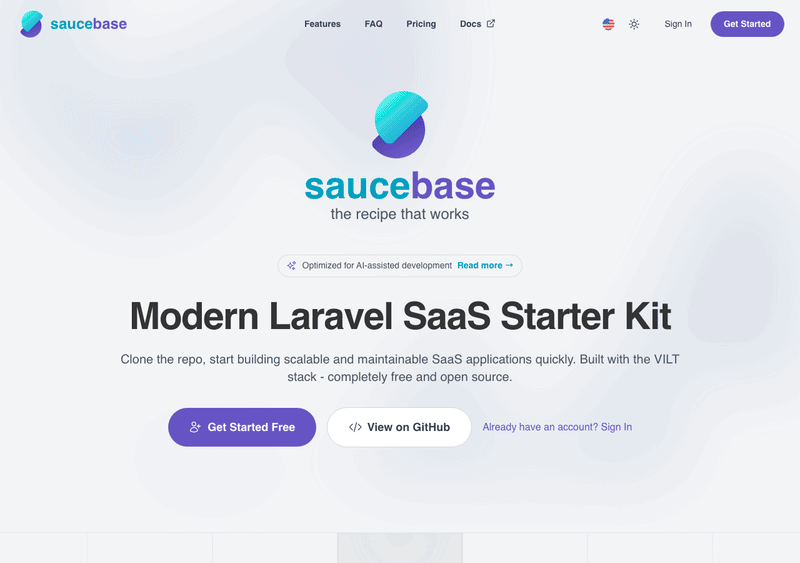

  

  <h1>Saucebase</h1>

  
An enterprise-grade, modular Laravel SaaS starter kit. Own your code, ship faster.

  

    
    
    
    
    
    
    
    
    
    
    
    
    
    
    
  

  

  

    Built on the VILT stack (Vue 3, Inertia.js, Laravel 12, Tailwind CSS 4) with TypeScript, SSR support,
    and a copy-and-own module system inspired by shadcn/ui. Install only what you need, customize everything,
    no vendor lock-in.
  

  

    <a href="https://sauce-base.github.io/docs/what-is-saucebase">What is Saucebase?</a> |
    <a href="https://sauce-base.github.io/docs/getting-started/installation">Installation</a> |
    <a href="https://sauce-base.github.io/docs/">Docs</a>
  

  <h2>Modules</h2>

  

    <a href="https://github.com/sauce-base/auth">Auth</a> |
    <a href="https://github.com/sauce-base/settings">Settings</a> |
    <a href="https://github.com/sauce-base/billing">Billing</a>
  

